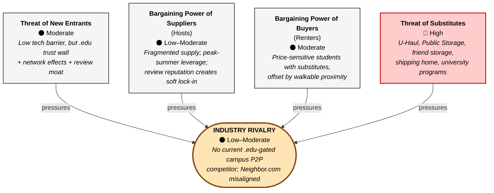

# Porter's Five Forces — Diagram Specification

> This file follows [`../AGENT.md`](../AGENT.md). Last synced: 2026-04-16.
>
> **Purpose**: companion diagram for Task 2 §2.2 → **Figure 3**
> **Source text**: [`../drafts/02_strategy.md:29-47`](../drafts/02_strategy.md#L29-L47) (intensities and evidence must match the prose)
> **Tool**: prefer Mermaid (VS Code Preview renders it directly); fall back to draw.io if style needs to match other diagrams
> **Export**: `porter_five_forces.png` (A4 landscape or 4:3, 300 DPI)
> **Caption**: `Figure 3. Porter's Five Forces Analysis for CampusShare Storage.`

---

## Intensity summary (from draft §2.2)

| Force | Intensity | One-line evidence |
|---|---|---|
| Threat of New Entrants | **Moderate** | Low technical barrier, but the `.edu` trust wall + two-sided network effects + review data create time-based defensibility |
| Bargaining Power of Suppliers (Hosts) | **Low–Moderate** | Fragmented supply; peak-summer leverage; review-reputation soft lock-in |
| Bargaining Power of Buyers (Renters) | **Moderate** | Price-sensitive students with visible substitutes, offset by walkable campus proximity |
| Threat of Substitutes | **High** ⚠ | U-Haul / Public Storage / friend storage / shipping home / university programs |
| Industry Rivalry | **Low–Moderate** | No current `.edu`-gated campus P2P storage competitor; Neighbor.com / SpareFoot misaligned |

---

## Mermaid source (drop into a Markdown preview)



---

## Layout notes (if drawing in draw.io instead)

```
          ┌─────────────────────────────┐
          │  Threat of New Entrants     │
          │  Moderate                    │
          └──────────────┬──────────────┘
                         │
                         ▼
┌───────────────┐ ┌─────────────┐ ┌────────────────┐
│  Suppliers    │ │   RIVALRY    │ │    Buyers     │
│(Hosts)        │→│ Low–Moderate │←│  (Renters)    │
│Low–Moderate   │ │   (center)   │ │  Moderate     │
└───────────────┘ └──────┬───────┘ └────────────────┘
                         ▲
                         │
          ┌──────────────┴──────────────┐
          │  Threat of Substitutes      │
          │  HIGH  ⚠                    │
          └─────────────────────────────┘
```

- **Center box** = Industry Rivalry, scaled 1.3× with a warm fill (light orange / yellow) and a thicker border for emphasis
- **Four surrounding forces** = north/east/south/west positions; each box holds 3 lines: force name / intensity label / 1-line evidence
- **Substitutes** uses a red warning fill (because intensity is highest)
- **Arrows** point from each force into the central Rivalry (showing pressure direction)
- **Typography**: titles bold 14 pt, evidence regular 10 pt, everything fits on one page

---

## draw.io steps (fallback route)

1. Open https://app.diagrams.net/ → New → Blank Diagram
2. From Shapes > General drag 5 rectangles
3. Rename the center rectangle "Industry Rivalry" and fill it with light orange `#FFE4B5`
4. Arrange the other 4 rectangles around it per the layout above
5. Fill the Substitutes rectangle with light red `#FFCCCC`
6. Draw arrows from the four surrounding forces toward the center
7. Text: 14 pt bold titles, 10 pt italic evidence
8. File → Export as → PNG (Border 20, 300 DPI; uncheck transparent background)
9. Save as `../diagrams/porter_five_forces.png`

---

## Full-marks checklist

- [ ] All 5 forces present (names match Porter 1985 terminology exactly)
- [ ] Every force shows an intensity label matching draft §2.2 (Moderate / Low-Moderate / Moderate / High / Low-Moderate)
- [ ] Each force shows a 1-line key evidence statement (≤ 15 words)
- [ ] Substitutes stands out visually (High-intensity warning styling)
- [ ] Rivalry is centered and visually enlarged
- [ ] Arrows point from each of the 4 forces into central Rivalry
- [ ] Figure 3 caption centered below the diagram
