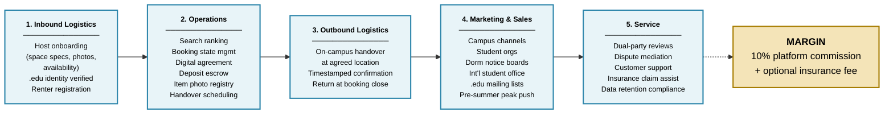

# Porter's Value Chain — Diagram Specification

> This file follows [`../AGENT.md`](../AGENT.md). Last synced: 2026-04-16.
>
> **Purpose**: visual companion to the Task 4 §4.1 table → **Figure 4**
> **Source text**: [`value_chain_table.md`](value_chain_table.md) + [`../drafts/04_business_execution.md:26-34`](../drafts/04_business_execution.md#L26-L34)
> **Tool**: prefer Mermaid; to mimic Porter's classic "arrow-chevron" style, switch to draw.io
> **Export**: `value_chain.png` (A4 landscape, 300 DPI)
> **Caption**: `Figure 4. CampusShare Storage Primary Activities Mapped to Porter's Value Chain.`

---

## Mermaid source (horizontal 5-stage flow)



---

## Visual layout (Porter classic arrow-chevron — draw.io route)

The canonical Porter value chain shape is a **chevron/arrow band** (like an arrow flying to the right), with Support Activities on top and Primary Activities on the bottom. This project only draws the Primary Activities:

```
╔══════════════════════════════════════════════════════════════════════════════╗
║                    CampusShare Storage Primary Activities                     ║
║ ┌─────────┬─────────┬─────────┬─────────┬─────────┐                          ║
║ │ Inbound │Operations│Outbound │Marketing│ Service │──►  MARGIN              ║
║ │Logistics│         │Logistics│ & Sales │         │   (10% commission       ║
║ │         │         │         │         │         │    + insurance)         ║
║ └─────────┴─────────┴─────────┴─────────┴─────────┘                          ║
║                                                                              ║
║  Host       Search,   On-campus  Campus    Reviews,                          ║
║  onboarding booking,  handover,  channels, disputes,                         ║
║  .edu       escrow,   timestamped .edu     support,                          ║
║  verified   agreement confirmation mailing  insurance                        ║
║                                                                              ║
║             ◄─── Focused Differentiation Strategy ───►                      ║
╚══════════════════════════════════════════════════════════════════════════════╝
```

- 5 equal-width segments, with an arrow tip on the right end
- Each segment: bold uppercase stage name at the top, 3–5 bullet points beneath
- Separate "MARGIN" box on the right (light yellow), connected to the band by a dashed line, indicating profit source
- Subtitle centered beneath the whole figure: *"Focused Differentiation Strategy"*

---

## Drawing steps (draw.io)

1. https://app.diagrams.net/ → New Diagram
2. Shapes > search "chevron" or "arrow" → drag 5 arrow shapes and butt them together horizontally
3. Or simplify: drag 5 rectangles, and make the rightmost a pentagon (chevron) with a pointed right edge
4. Fill each box light blue `#E8F4F8`, border dark blue `#2E86AB`
5. Typography: stage name bold 13 pt, bullets regular 10 pt
6. Add one more box on the right labeled "MARGIN", filled light yellow `#F4E4B8`
7. Add centered caption at the bottom: "Focused Differentiation Strategy"
8. File → Export → PNG (Border 20, 300 DPI)
9. Save as `../diagrams/value_chain.png`

---

## 5-segment content (copy directly from value_chain_table.md)

| Stage | Bullets (in-band text) |
|---|---|
| 1. Inbound Logistics | Host onboarding · space specs & photos · availability windows · .edu identity verified · Renter registration |
| 2. Operations | Search ranking · Booking state mgmt · Digital agreement · Deposit escrow · Item photo registry · Handover scheduling |
| 3. Outbound Logistics | On-campus handover at agreed location · Timestamped confirmation · Return at booking close |
| 4. Marketing & Sales | Campus channels · Student orgs · Dorm notice boards · Int'l student office · .edu mailing lists · Pre-summer peak push |
| 5. Service | Dual-party reviews · Dispute mediation · Customer support · Insurance claim assistance · Data retention compliance |

---

## Full-marks checklist

- [ ] All 5 Primary Activities present and in the correct order (Inbound → Operations → Outbound → Marketing → Service)
- [ ] Each segment's content matches [`value_chain_table.md`](value_chain_table.md)
- [ ] Margin box on the right (showing 10% commission + insurance)
- [ ] Bottom subtitle reads "Focused Differentiation Strategy"
- [ ] Figure 4 caption is centered below the diagram
- [ ] Fits a single A4 landscape page with readable type (≥ 10 pt)
